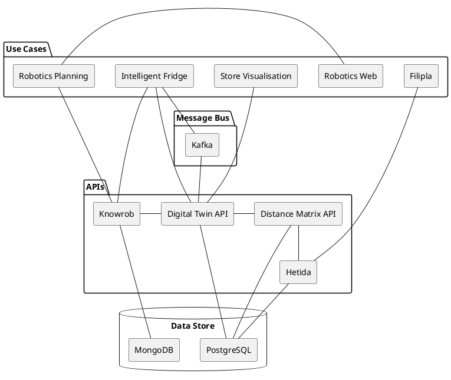
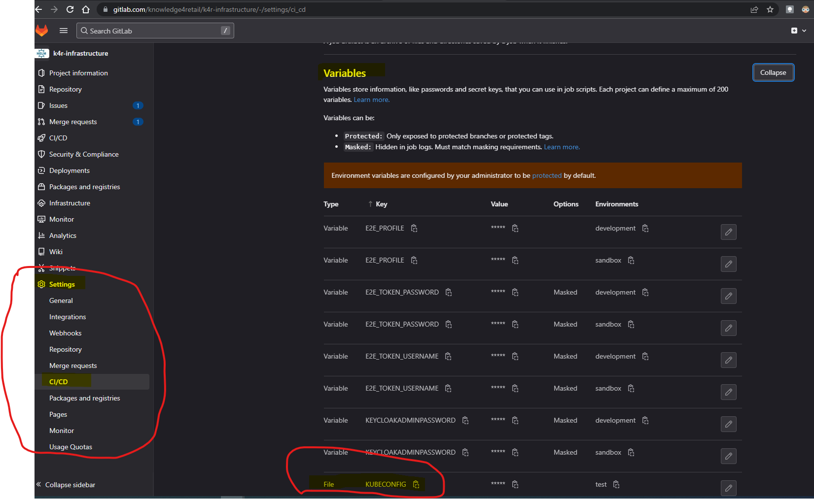

# K4R Infrastructure

- [K4R Infrastructure](#k4r-infrastructure)
  - [Architecture](#architecture)
  - [Environments \& Clusters](#environments--clusters)
    - [1- Deployment on Azure Kubernetes Service (AKS)](#1--deployment-on-azure-kubernetes-service-aks)
      - [Requirements](#requirements)
      - [Environment Installation Steps](#environment-installation-steps)
        - [Cluster setup](#cluster-setup)
        - [Azure Storage Setup](#azure-storage-setup)
        - [Public IP Address (Optional)](#public-ip-address-optional)
        - [Deployment](#deployment)
          - [Note about secrets](#note-about-secrets)
          - [Note about docker images](#note-about-docker-images)
    - [2- Deployment on local microk8s on Windows](#2--deployment-on-local-microk8s-on-windows)
      - [Assumptions](#assumptions)
      - [Install tool chain](#install-tool-chain)
    - [3- Deployment on local microk8s on Linux](#3--deployment-on-local-microk8s-on-linux)
      - [helmfile](#helmfile)
      - [microk8s](#microk8s)
      - [Get our Project running](#get-our-project-running)
    - [4- Deployment on local minikube on Windows](#4--deployment-on-local-minikube-on-windows)
      - [Assumptions](#assumptions-1)
      - [Install tool chain](#install-tool-chain-1)
  - [CD Pipeline Configuration (Gitlab Example)](#cd-pipeline-configuration-gitlab-example)
  - [Usage](#usage)
    - [Access to web endpoints protected by client certificates](#access-to-web-endpoints-protected-by-client-certificates)

## Architecture

The following diagram is just an example to showcase the main components of the k4r platform. It does not reflect all the capabilities/components of the platform.



## Environments & Clusters

There are multiple cluster environments that can be chosen for deployment. Each of them have different requirements. Please check which environment fits best for your needs.

Currently available environments are listed in `environments.yaml` file.

### 1- Deployment on Azure Kubernetes Service (AKS)

Setup of Azure AKS cluster for development environment of the research project.

#### Requirements

- Azure Account

#### Environment Installation Steps

1. [Setup](#cluster-setup) Kubernetes Cluster with Azure AKS
1. [Add](#azure-storage-setup) Azure Storage Account
1. (Optional) [Dedicated Public IP](#public-ip-address-optional) Address in case of deployment to `*.subdomain.knowledge4retail.org`

##### Cluster setup

The cluster setup requires `azure-cli` in version >= `2.41.0`

```bash
# login to azure account


az login

## Follow the instructions to open a browser tab and login to azure account

# create a resource group
## A list of all azure regions can be found here:
### https://azure.microsoft.com/en-us/explore/global-infrastructure/geographies/#geographies 
az group create --name $RESOURCE_GROUP --location $RG_LOCATION

### example:
az group create --name k4r-dev --location germanywestcentral

# create an AKS (Azure Kubernetes Service)

## Create a kubernetes cluster with default kubernetes version, Node Type: Standard_DS2_v2, 4 nodes, default SKU load balancer (Standard) and default vm set type (VirtualMachineScaleSets) with at least 4 nodes scaling up to maximum of 10 nodes.
az aks create -g $RESOURCE_GROUP -n $CLUSTER_NAME --generate-ssh-keys --node-count 4 --enable-cluster-autoscaler --min-count 4 --max-count 10

### example:
az aks create -g k4r-dev -n k4r-platform-dev --generate-ssh-keys --node-count 4 --enable-cluster-autoscaler --min-count 4 --max-count 10

### IMPORTANT: ### For linux, the command must be run with root privileges i.e. with sudo
sudo az aks create -g k4r-demo -n k4r-demo-cluster --generate-ssh-keys

## the full reference of the `az aks create` command can be found here: https://docs.microsoft.com/en-us/cli/azure/aks?view=azure-cli-latest#az_aks_create

### It will take some minutes until the cluster and the corresponding services (Load-balancer, Networks, Storage...) are deployed.

## to gain access to the created cluster
az aks get-credentials --resource-group $RESOURCE_GROUP --name $CLUSTER_NAME

### example:
az aks get-credentials --resource-group k4r-dev --name k4r-platform-dev

## Create namespace for the deployment
kubectl create namespace $NAMESAPCE

### example:
kubectl create namespace k4r-ns

```

##### Azure Storage Setup

``` bash

#### ----Creating Azure Storage Account---- ####

# create azure storage in the same resource group where the cluster is with locally redundant storage
## Storage account name must be between 3 and 24 characters in length and use numbers and lower-case letters only
az storage account create -n $STORAGE_ACCOUNT -g $RESOURCE_GROUP --sku Standard_LRS

### example:
az storage account create -n k4rdevstorage -g k4r-dev  --sku Standard_LRS

# create azure storage container for the device images:
az storage container create -n $STORAGE_CONTAINER_NAME --fail-on-exist --account-name $STORAGE_ACCOUNT_NAME

### example:
az storage container create -n k4r-device-images --fail-on-exist --account-name k4rdevstorage

```

##### Public IP Address (Optional)

``` bash

# in case of the deployment to a given *.mydeploymentsubdomain.knowledge4retail.org we need to have a dedicated static public IP address that the DNS name points to.
# this static public IP address needs to be created in the same resource group where the cluster resources are created
# this resource group is usually called something like: MC_$RESOURCE_GROUP_$CLUSTER_NAME_$REGION_NAME
# for example for k4r-platform-dev cluster in germany west central region in resource group k4r-dev, the resource group would be: MC_k4r-dev_k4r-platform-dev_germanywestcentral
az network public-ip create -g $RESOURCE_GROUP -n $MY_IP  --allocation-method Static --sku Standard --tier Regional

# for example in case of k4r-dev Cluster:
az network public-ip create -g MC_k4r-dev_k4r-platform-dev_germanywestcentral -n k4r-dev-ingress-ip --allocation-method Static --sku Standard --tier Regional


```

##### Deployment

**********

__Important__

###### Note about secrets

Before deploying any of the infrastructure components or any of the k4r applications, make sure to check the `README.md` files for each of these applications and follow the instructions to initialize the cluster with the required secrets to run deployments successfully.

Some examples:

- have a look at the secret file [k4r-passwords in config folder](config/k4r-passwords.yaml)
- have a look at the secret files in the basic-infrastructure folder like this one for [postgresql](basic-infrastructure/postgresql/README.md) and [mongo](basic-infrastructure/mongo/README.md)
- have a look at the secret files in the k4r-applications folder like this one for [k4r-dt-api](k4r-applications/k4r-dt-api/README.md) and [k4r-fridge](k4r-applications/k4r-fridge/README.md)

###### Note about docker images

This project requires that you build the docker images and push them to an image registry before trying to deploy it on Kubernetes using `helmfile`.

The docker image registry must be *accessible* from your deployment environment.

Refer to the documentation of each k4r-application to get more information on how to build the project image(s).

Usually it is a straightforward process using `docker build` command

```bash
docker build -t <image-name> .
```

After building the docker images, you need to push them to the chosen registry so that they can be pulled from the cluster and deployed on Kubernetes.

Before deploying, make sure to update the `image` variable in the `values.yaml` file with the name/url of the pushed image.

for example for the digital twin api [k4r dt-api](k4r-applications/k4r-dt-api/values.yaml)

For more information on deploying with helmfile, see the [helmfile documentation](https://helmfile.readthedocs.io/en/latest/).

**********

to deploy to the newly created environment use the following command:

```bash
## $ENVIRONMENT_NAME: as seen on environments.yaml
## $NAMESPACE: Kubernetes Namespace
helmfile -e $ENVIRONMENT_NAME --namespace $NAMESAPCE sync
```

### 2- Deployment on local microk8s on Windows

This guide was tested on Windows 10 Pro, version 2004 in June 2021.

#### Assumptions

- Windows 10 with Hyper-V role installed
- No kubernetes tools (kubectl, helm etc.) preinstalled
- direct internet connectivity with no outbound proxies or firewalls
- [Chocolatey](https://chocolatey.org/install) is installed

#### Install tool chain

Install helm:

```bash
choco install kubernetes-helm
```

Install helmfile:

```bash
# Powershell:
iwr -useb get.scoop.sh | iex
scoop install helmfile

# This will output the installation directory of helmfile.exe
# Add this directory to PATH manually.
```

Install lens:

- Download from <https://k8slens.dev/>
- Run the installer

Install microk8s:

- Download Windows executable from <https://microk8s.io/docs/install-alternatives>
- Run the installer
- Allocate at least 4 CPU and 8Gi RAM to VM
- Important: Change snap track from 1.18/stable to 1.21/stable
- Wait for the installer to finish and vm setup to complete

Configure microk8s:

```bash
#Powershell or cmd:

# Wait for installation to finish
microk8s status --wait-ready

# Enable addons
microk8s enable dns rbac storage

# Find and take note of your microk8s vm ip address <VMIPADDRESS>
multipass exec microk8s-vm -- ifconfig eth0 #look for inet entry

# Enable and configure microk8s metallb addon using your vm ip
microk8s enable metallb:<VMIPADDRESS>-<VMIPADDRESS>

# Create .kube folder for cluster connection information
mkdir %userprofile%\.kube

# Load cluster connection config
microk8s config > %userprofile%\.kube\config
```

Deploy k4r to your microk8s cluster:

```bash
# Powershell or cmd:

# Clone k4r-infrastructure repository:
https://gitlab.com/knowledge4retail/k4r-infrastructure.git

# Change to directory:
cd k4r-infrastructure

# Deploy
helmfile -e microk8s sync

# You may open lens and import %userprofile%\.kube\config to connect and watch progress
```

Connect to k4r services:

Enable k4r host name resolution to your vm:

```bash
# Add this entry to c:\windows\system32\drivers\etc\hosts
<VMIPADDRESS> knowledge4retail.local hetida.knowledge4retail.local dt-api.knowledge4retail.local distance-matrix-api.knowledge4retail.local knowrob.knowledge4retail.local
```

Done!

### 3- Deployment on local microk8s on Linux

This guide was tested on Ubuntu 18.04 on the 03.08.2021

Assumption:
Helmfile, mircok8s not installed
snap works as intended

#### helmfile

Go to <https://github.com/helmfile/helmfile/releases> pick the correct binary and download it.

```bash
# Make it execuable:
chmod +x helmfile_linux_amd64

# Move it to you local binary programs
mv helmfile_linux_amd64 ~/.local/bin/helmfile
```

#### microk8s

Install microk8s via snap

```bash
sudo snap install microk8s --classic
```

Add yourself to the microk8s group:

```bash
sudo usermod -a -G microk8s $USERNAME
```

Check if user is microk8s group

```bash
id
# Example output:
uid=1001(nleusmann) gid=1001(nleusmann) groups=1001(nleusmann),[...],998(microk8s)

# if not relog via
su [username]
```

check if mircok8s is working:

```bash
microk8s status --wait-ready
```

There should be something like: micro is running

Enable addons:

```bash
microk8s enable dns rbac storage

microk8s enable metallb:[IPADDRESS]-[IPADDRESS]
```

Create .kube folder for cluster connection information (may already exsist)

```bash
mkdir ~/.kube
# Load cluster connection config
microk8s config > ~/.kube/config
```

#### Get our Project running

```bash
# Clone k4r-infrastructure repository:
https://gitlab.com/knowledge4retail/k4r-infrastructure.git

# Change to directory:
cd k4r-infrastructure

# Deploy
~/.local/bin/helmfile -e microk8s sync
```

### 4- Deployment on local minikube on Windows

This guide was tested on Windows 10 Pro, version 2004 in Jan 2022.

#### Assumptions

- Windows 10 with Hyper-V role installed
- No kubernetes tools (kubectl, helm etc.) preinstalled
- direct internet connectivity with no outbound proxies or firewalls
- [Chocolatey](https://chocolatey.org/install) is installed

#### Install tool chain

Install kubectl via choco:

```bash
choco install kubernetes-cli
```

Alternative install kubectl via curl:

```bash
curl -LO "https://dl.k8s.io/release/v1.22.0/bin/windows/amd64/kubectl.exe"
```

Install minikube via choco:

```bash
choco install minikube

# start minikube with hyper-V as VM
minikube start driver=hyperv

# Enable following addons
minikube addons enable registry ingress 
```

Add bin to your environment variables in `$PATH`

```bash
C:\ProgramData\chocolatey\bin
```

Create `.kube` folder for cluster connection information (may already exsist)

```bash
mkdir ~/.kube
# config with the Cluster connection is created automatically
# ~/.kube/config
```

check if minikube is working

```bash
minikube status
```

## CD Pipeline Configuration (Gitlab Example)

Configuring a CD pipeline allows you to automatically test, and deploy your k4r instance whenever new code is pushed to the repository. This can save time and reduce the potential for errors, as manual deployment steps are eliminated.

There is already a sample configuration provided with the repository for `Gitlab CI/CD`. This can be found [here](.gitlab-ci.yml).

In order for the configuration in the file mentioned above to work, you initially need to create a service account and a cluster role binding for the desired deployment namespace.

Cluster admin role is needed because some of the charts install CRDs.

```yaml
---
apiVersion: v1
kind: ServiceAccount
metadata:
  name: admin-ci
  namespace: k4r-dev
---
apiVersion: rbac.authorization.k8s.io/v1
kind: ClusterRoleBinding
metadata:
  name: k4r-dev-admin-ci
  namespace: k4r-dev
roleRef:
  apiGroup: rbac.authorization.k8s.io
  kind: ClusterRole
  name: cluster-admin
subjects:
- kind: ServiceAccount
  name: admin-ci
  namespace: k4r-dev
---
apiVersion: v1
kind: Secret
metadata:
  name: admin-ci-secret
  namespace: k4r-dev
  annotations:
    kubernetes.io/service-account.name: admin-ci
type: kubernetes.io/service-account-token

```

Then use the secret of the service account `admin-ci-secret` for generating kubeconfig. The kubeconfig must be stored as a GitLab CI file variable with the name `KUBECONFIG`.



## Usage

### Access to web endpoints protected by client certificates

Cluster admins have to provide the client certificate, which is stored as secret in the cluster.

The client certificate is in pkcs#12 container and can be stored into a local file with:

```bash
kubectl get secret self-signed-client-certificate -ojsonpath='{.data.keystore\.p12}' | base64 -d > /tmp/client-certificate.p12
```

The corresponding client certificate passphrase can be retrieved with:

```bash
kubectl get secret self-signed-client-certificate-passphrase -ojsonpath='{.data.passphrase}' | base64 -d && echo
```

Please ask a cluster admin to provide the certificate data. Then import the client certificate in the system certificate store or in the browser certificate store.
